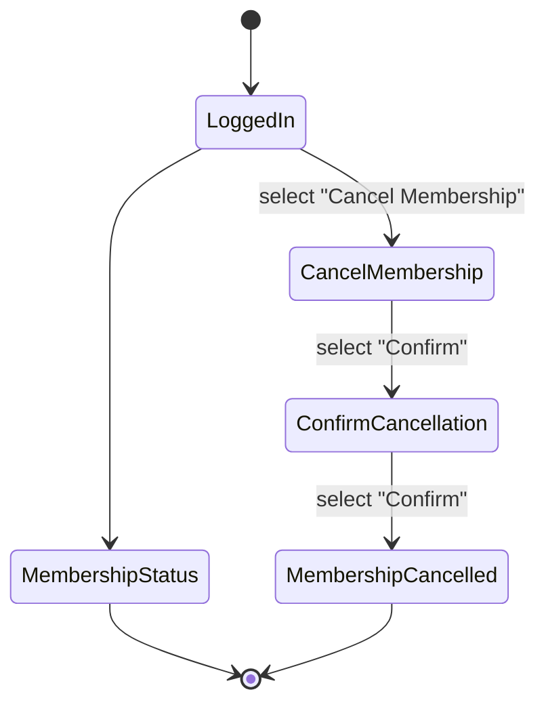
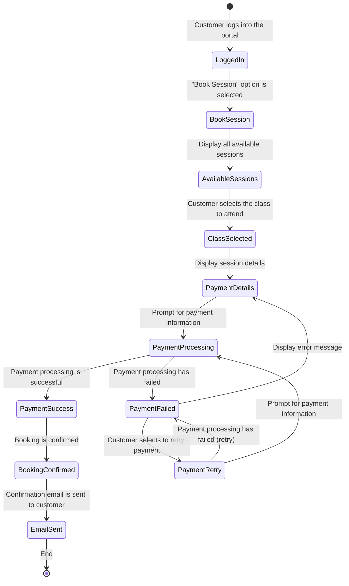
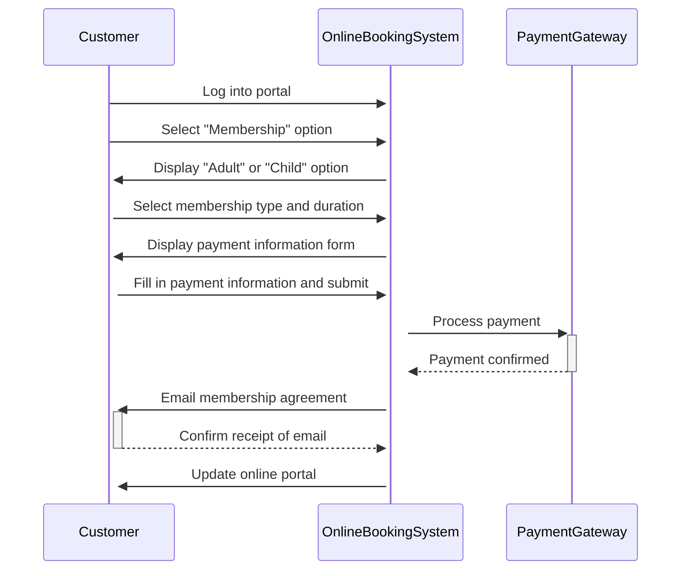
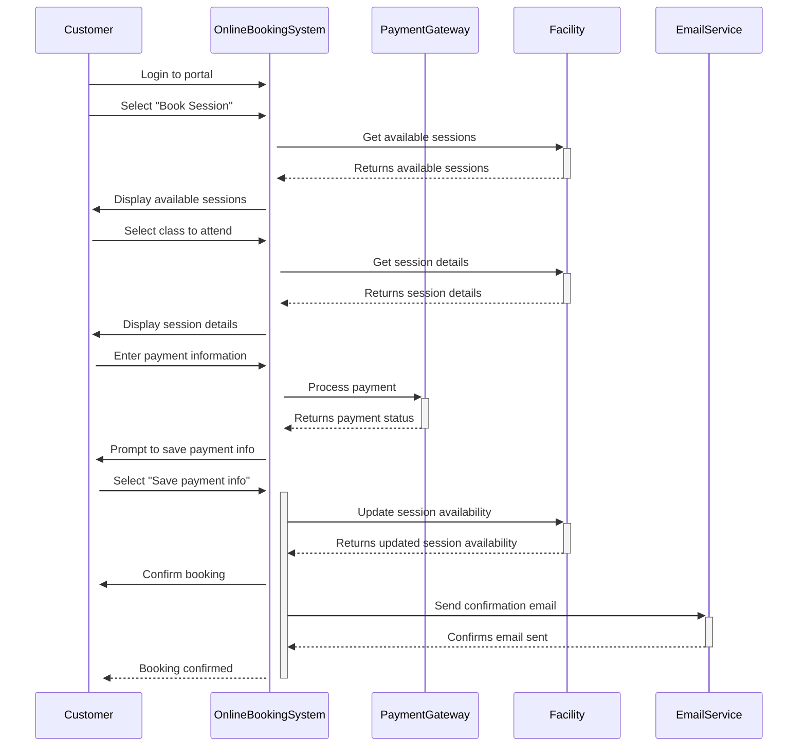
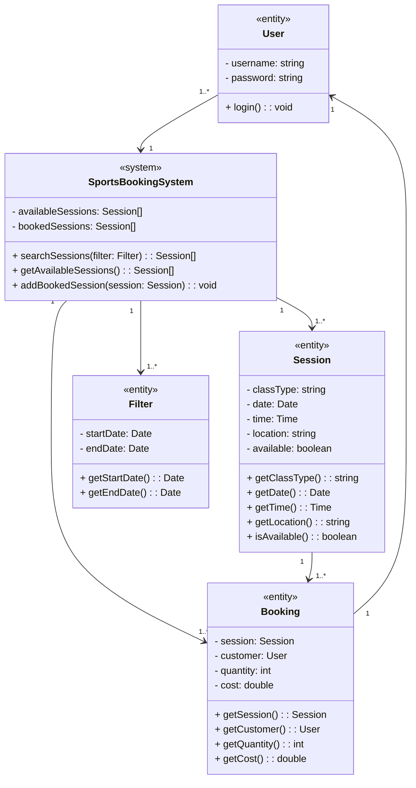
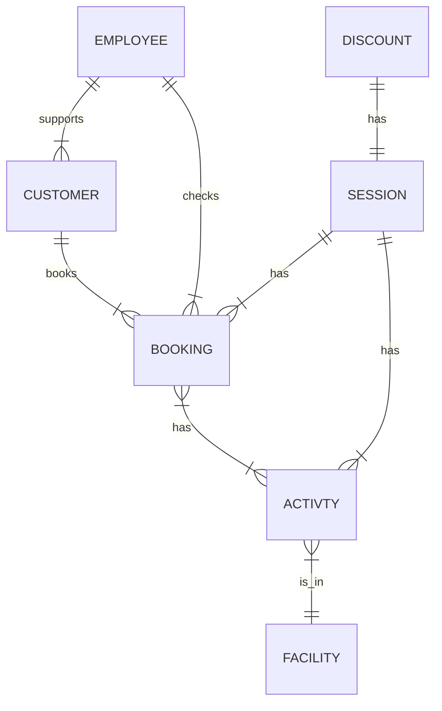

Design Documents

## Sprint 1 UML:

### State diagrams

### Sequence diagrams

### Class diagram

### ERD:

Here are our fields for the ERD diagram:

<html>
<body>
<!--StartFragment-->

Table Name | Field Name | Data Type
-- | -- | --
Customer | id | int
  | first_name | string
  | last_name| string
  | email | string
  | phone_number | string
  | date_of_birth | string
  | gender | string
  | membership | bool
Employee | id | int 
  | |first_name | string|
  | last_name| string
  | email | string
  | phone_number | string
  | date_of_birth | string
  | password | string |
Booking | id | int
  | customer_id (FK) | int
  | employee_id (FK) | int
  | session_id (FK) | int
  | activity_id (FK) | int
  | number_of_people | int
Activity | id | int
  | name | string 
  | booking_type | string
  || price | float
  || duration | in
  || times | string |
  | facility_id (FK) | int |
Session | id | int |
  | date | string |
  ||start_time | int
  ||number_of_people | int 
  |activity_id (FK) | int |
Facility | id | int |
  | |name | string
  | capacity | int 
  | |activity_id (FK) | int 
Discount | id | int |
  || discount | int 

<!--EndFragment-->
</body>
</html>